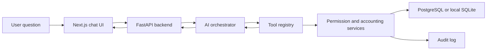

# MVP Architecture

The MVP keeps AI away from uncontrolled database access.

## Tool Boundary

The AI layer may choose tools and provide parameters such as `vendor_id`, `company_id`, `as_of_date`, and `document_no`. The backend validates scope and runs controlled queries.

## First Use Case

Question: "What is this vendor balance and which documents make it up?"

Required output:

- vendor identity and company
- as-of date
- opening, debit, credit, and closing balance
- source documents with document and posting dates
- reversal or missing-data warnings
- audit log entry
