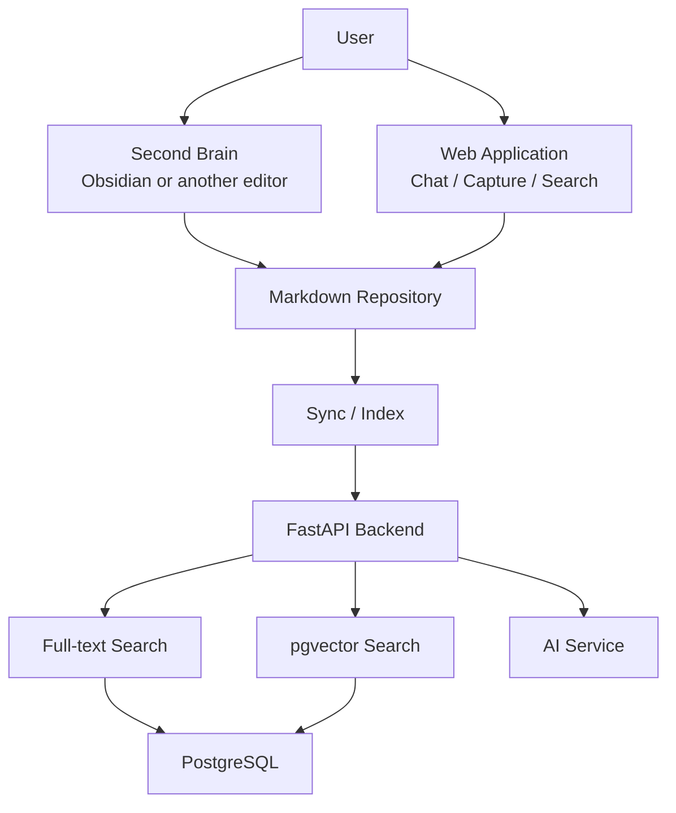

# Second Brain Knowledge Architecture

The adjusted architecture treats Markdown as the source of truth for knowledge.

## Role Of Second Brain

Second Brain is the working space for:

- writing knowledge
- linking notes
- grouping accounting, tax, client, and SOP knowledge
- reviewing and editing AI-generated content
- keeping personal thinking before publishing organization knowledge

Humans can keep writing directly in Obsidian, while the AI reads the same Markdown repository after sync.

## MVP Implementation

- Markdown source lives in `knowledge-vault/`.
- FastAPI sync endpoint reads Markdown and indexes notes into `knowledge_notes`.
- Search is currently SQL full-text-like matching with title/content/tag filters.
- pgvector is reserved for the next phase when embeddings are enabled.
- AI chat answers from retrieved Markdown context only and returns source notes.

## Endpoints

- `POST /api/knowledge/sync`
- `POST /api/knowledge/search`
- `POST /api/knowledge/capture`
- `POST /api/knowledge/chat`
