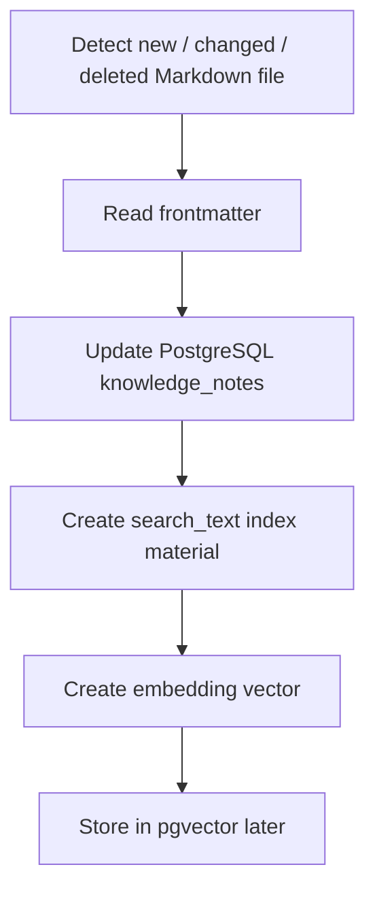

# Markdown Synchronization Pipeline

When Markdown changes, the backend follows this pipeline:



## Current MVP

- Detection: scans `knowledge-vault/**/*.md` and compares SHA-256 `content_hash`.
- Frontmatter: parses YAML-like `---` blocks without extra dependencies.
- Database: updates `knowledge_notes` incrementally.
- Search index: stores normalized `search_text` for SQL full-text-like search.
- Embedding: defaults to deterministic local vectors so Markdown knowledge does not leave the machine. OpenAI embeddings are used only when `ENABLE_OPENAI_EMBEDDINGS=true` is set explicitly.

## Run The Watcher

```powershell
python backend\scripts\watch_markdown.py
```

The watcher polls the Markdown repository every 5 seconds and prints sync stats only when files are created, updated, or deleted.

## Target PostgreSQL / pgvector Step

Replace `embedding_json` with a pgvector column:

```sql
CREATE EXTENSION IF NOT EXISTS vector;
ALTER TABLE knowledge_notes ADD COLUMN embedding vector(1536);
CREATE INDEX knowledge_notes_embedding_idx
ON knowledge_notes USING ivfflat (embedding vector_cosine_ops);
```

The API contract can stay the same while storage moves from SQLite JSON to PostgreSQL pgvector.

## Privacy Default

Markdown content is personal or organizational knowledge. The default sync path never sends note content to an external AI service.
